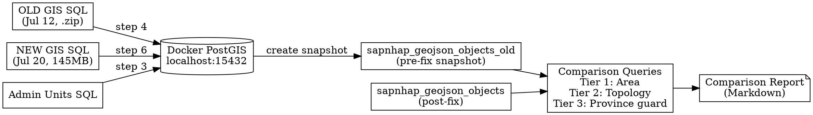

# GIS Geometry Fix — Before/After Comparison Design

**Date**: 2026-07-24
**Status**: Design approved, pending implementation
**Depends on**: 2026-07-20-gis-geometry-fix (the fix being validated)

## Objective

Import both the old (pre-fix, July 12) and new (post-fix, July 20) GIS data into a local PostGIS database, run area and topology comparison queries, and produce a detailed report confirming the `ST_MakeValid` fix did not introduce data corruption or sharp area reductions.

## Scope

- **78 fixed wards** from the fix audit log — primary comparison target
- **34 provinces** — guard check ensuring zero cascading changes from ward fixes
- Total: 112 geometries compared

## Files Involved

| File | Role |
|------|------|
| `postgresql/gis/postgresql_ImportData_gis_2026-07-12__19_50_50.sql.zip` | OLD GIS data (pre-fix) |
| `dataset-generation-scripts/output/gis/postgresql_ImportData_gis_2026-07-20__23_14_35.sql` | NEW GIS data (post-fix) |
| `dataset-generation-scripts/output/gis_geometry_fix_log_2026-07-20__23_14_32.txt` | Fix audit log (78 ward codes, 22 provinces) |
| `postgresql/postgres_ImportData_vn_units.sql` | Administrative units (required before GIS import) |

## Architecture



## Implementation Steps

### Step 1: Start Docker PostGIS

```bash
docker compose -f dataset-generation-scripts/docker/docker-compose.yaml up -d
```

Verify:
```bash
docker exec vn_provinces_postgres_container psql -U postgres -d vn_provinces_tmp -c "SELECT 1;"
```

### Step 2: Initialize Database Schema

```bash
docker exec vn_provinces_postgres_container psql -U postgres -d vn_provinces_tmp \
  -f dataset-generation-scripts/resources/db_table_init.sql
docker exec vn_provinces_postgres_container psql -U postgres -d vn_provinces_tmp \
  -f dataset-generation-scripts/resources/db_region_administrative_unit.sql
docker exec vn_provinces_postgres_container psql -U postgres -d vn_provinces_tmp \
  -f dataset-generation-scripts/resources/gis/sapnhap_bando_tables.sql
```

### Step 3: Import Administrative Units

Required by the GIS data import (FK references to `provinces_tmp`, `wards_tmp`).

```bash
cat postgresql/postgres_ImportData_vn_units.sql | \
  docker exec -i vn_provinces_postgres_container psql -U postgres -d vn_provinces_tmp
```

Verify row counts:
```bash
docker exec vn_provinces_postgres_container psql -U postgres -d vn_provinces_tmp \
  -c "SELECT COUNT(*) FROM provinces_tmp;"
docker exec vn_provinces_postgres_container psql -U postgres -d vn_provinces_tmp \
  -c "SELECT COUNT(*) FROM wards_tmp;"
```

### Step 4: Import OLD GIS Data (July 12 — Pre-Fix)

```bash
unzip -p postgresql/gis/postgresql_ImportData_gis_2026-07-12__19_50_50.sql.zip | \
  docker exec -i vn_provinces_postgres_container psql -U postgres -d vn_provinces_tmp
```

Verify: 3,355 records.

### Step 5: Snapshot Old Data

```sql
CREATE TABLE sapnhap_geojson_objects_old (LIKE sapnhap_geojson_objects INCLUDING ALL);
INSERT INTO sapnhap_geojson_objects_old SELECT * FROM sapnhap_geojson_objects;
```

### Step 6: Clean & Re-Import NEW GIS Data (July 20 — Post-Fix)

```bash
# Recreate schema
docker exec vn_provinces_postgres_container psql -U postgres -d vn_provinces_tmp \
  -f dataset-generation-scripts/resources/fresh_cleanup.sql
# Re-run Step 2 (schema init)
# Re-run Step 3 (admin units) — sapnhap_geojson_objects_old survives cleanup if not dropped
# Import new GIS data
docker exec -i vn_provinces_postgres_container psql -U postgres -d vn_provinces_tmp \
  < dataset-generation-scripts/output/gis/postgresql_ImportData_gis_2026-07-20__23_14_35.sql
```

**Safety confirmed**: `fresh_cleanup.sql` only drops `sapnhap_geojson_objects` (not `sapnhap_geojson_objects_old`). The `_old` snapshot table created in Step 5 survives the cleanup untouched. No dual-schema workaround needed.

### Step 7: Verify Both Tables

```sql
SELECT 'old' as source, COUNT(*) FROM sapnhap_geojson_objects_old
UNION ALL
SELECT 'new' as source, COUNT(*) FROM sapnhap_geojson_objects;
```

Expected: 3,355 each.

## Comparison Queries

### Tier 1: Area Comparison (All 78 Fixed Wards + 34 Provinces)

```sql
-- Wards: area comparison for the 78 fixed wards
SELECT 
    new.ma,
    new.ten,
    new.vn_ds_province_code,
    ROUND(ST_Area(ST_GeomFromText(old.geom_wkt, 4326)::geography) / 1000000, 6) AS old_area_km2,
    ROUND(ST_Area(ST_GeomFromText(new.geom_wkt, 4326)::geography) / 1000000, 6) AS new_area_km2,
    ROUND(
        (ST_Area(ST_GeomFromText(new.geom_wkt, 4326)::geography) - 
         ST_Area(ST_GeomFromText(old.geom_wkt, 4326)::geography)) / 1000000, 6
    ) AS area_diff_km2,
    ROUND(
        ABS((ST_Area(ST_GeomFromText(new.geom_wkt, 4326)::geography) - 
             ST_Area(ST_GeomFromText(old.geom_wkt, 4326)::geography)) 
        / NULLIF(ST_Area(ST_GeomFromText(old.geom_wkt, 4326)::geography), 0)) * 100, 6
    ) AS area_diff_pct
FROM sapnhap_geojson_objects new
JOIN sapnhap_geojson_objects_old old ON new.ma = old.ma
WHERE new.ma IN (
    '19066','31673','05542','06577','06607','03356','03472','03549','03394','03760',
    '15661','16177','19351','22504','21925','21943','23602','23586','21997','21835',
    '23611','23764','23767','23728','21892','24502','24529','25459','25585','25588',
    '25498','25510','26461','25843','25777','25807','00832','01096','00820','02788',
    '03583','03434','21040','23908','06565','06541','03460','03358','03352','19333',
    '16186','20656','20965','20242','20257','20669','23332','22870','22624','22888',
    '22741','22759','21985','24846','25567','28087','28075','04402','31249','30028',
    '32071','02842','31261','11983','12452','01075','00958','30154'
)
ORDER BY area_diff_pct DESC;
```

```sql
-- Provinces: guard check (all 34 provinces)
SELECT 
    new.ma,
    new.ten,
    ROUND(ST_Area(ST_GeomFromText(old.geom_wkt, 4326)::geography) / 1000000, 4) AS old_area_km2,
    ROUND(ST_Area(ST_GeomFromText(new.geom_wkt, 4326)::geography) / 1000000, 4) AS new_area_km2,
    ROUND(
        (ST_Area(ST_GeomFromText(new.geom_wkt, 4326)::geography) - 
         ST_Area(ST_GeomFromText(old.geom_wkt, 4326)::geography)) / 1000000, 4
    ) AS area_diff_km2,
    ROUND(
        ABS((ST_Area(ST_GeomFromText(new.geom_wkt, 4326)::geography) - 
             ST_Area(ST_GeomFromText(old.geom_wkt, 4326)::geography)) 
        / NULLIF(ST_Area(ST_GeomFromText(old.geom_wkt, 4326)::geography), 0)) * 100, 6
    ) AS area_diff_pct
FROM sapnhap_geojson_objects new
JOIN sapnhap_geojson_objects_old old ON new.ma = old.ma
WHERE new.magoc IS NULL  -- provinces have no parent
ORDER BY area_diff_pct DESC;
```

### Tier 2: Topology Change Detection

```sql
SELECT 
    new.ma,
    new.ten,
    new.vn_ds_province_code,
    ST_Equals(
        ST_GeomFromText(new.geom_wkt, 4326), 
        ST_GeomFromText(old.geom_wkt, 4326)
    ) AS is_geometrically_equal,
    ST_NPoints(ST_GeomFromText(new.geom_wkt, 4326)) - 
    ST_NPoints(ST_GeomFromText(old.geom_wkt, 4326)) AS point_count_delta,
    ST_NPoints(ST_GeomFromText(old.geom_wkt, 4326)) AS old_point_count,
    ST_NPoints(ST_GeomFromText(new.geom_wkt, 4326)) AS new_point_count,
    ST_NumGeometries(ST_GeomFromText(new.geom_wkt, 4326)) - 
    ST_NumGeometries(ST_GeomFromText(old.geom_wkt, 4326)) AS subgeom_count_delta,
    NOT ST_IsValid(ST_GeomFromText(old.geom_wkt, 4326)) AS old_was_invalid,
    NOT ST_IsValid(ST_GeomFromText(new.geom_wkt, 4326)) AS new_is_invalid
FROM sapnhap_geojson_objects new
JOIN sapnhap_geojson_objects_old old ON new.ma = old.ma
WHERE new.ma IN (/* same 78 ward codes */)
ORDER BY abs(point_count_delta) DESC, abs(subgeom_count_delta) DESC;
```

### Tier 3: Data Integrity Checks

```sql
-- Confirm zero invalid geometries remain in new data
SELECT COUNT(*) AS remaining_invalid FROM sapnhap_geojson_objects
WHERE NOT ST_IsValid(ST_GeomFromText(geom_wkt, 4326));

-- Confirm all old 78 were indeed invalid
SELECT COUNT(*) AS old_invalid FROM sapnhap_geojson_objects_old
WHERE NOT ST_IsValid(ST_GeomFromText(geom_wkt, 4326))
  AND ma IN (/* 78 ward codes */);

-- Check FK integrity
SELECT COUNT(*) AS orphaned FROM sapnhap_geojson_objects
WHERE vn_ds_province_code NOT IN (SELECT code FROM provinces_tmp)
   OR (vn_ds_ward_code IS NOT NULL AND vn_ds_ward_code NOT IN (SELECT code FROM wards_tmp));
```

## Thresholds & Classification

| Level | Relative Area Change | Absolute Area Change (wards < 1 km²) | Meaning |
|-------|---------------------|--------------------------------------|---------|
| 🟢 OK | < 0.001% | < 0.0001 km² | Expected ST_MakeValid noise at ~11cm precision |
| 🟡 WARN | 0.001% – 0.01% | 0.0001 – 0.001 km² | Slightly above expected fix noise — requires manual review |
| 🔴 ALARM | > 0.01% | > 0.001 km² | Possible data corruption — investigation mandatory |

**Province guard rule**: Any province with `area_diff_pct > 0%` is unexpected and automatically marked 🔴 ALARM since no province geometries were fixed. In practice, sub-0.001% may appear due to floating-point rounding—these should be noted but can be considered OK.

## Output Report Format

Report saved to `development/corrupted_gis_ward_data/gis_comparison_report_2026-07-24.md`.

### Report Sections

1. **Summary dashboard** — counts, max change, verdict
2. **Ranked ward comparison table** — all 78 wards sorted by `area_diff_pct` DESC with threshold colors
3. **Topology anomalies** — wards with significant point/sub-geometry changes
4. **Province guard results** — all 34 provinces
5. **Data integrity results** — remaining invalids, FK checks
6. **Final verdict** — SAFE / NEEDS REVIEW / BLOCKED

### Example Ward Table Format

```
| Rank | ma     | Name              | Prov | Old Area (km²) | New Area (km²) | Diff (km²) | Diff %      | Status |
|------|--------|-------------------|------|----------------|----------------|------------|-------------|--------|
| 1    | 28075  | Xã Tân Trụ        | 80   | 12.345678      | 12.345680      | +0.000002  | 0.000016    | 🟢 OK  |
| 2    | 19351  | P. Nam Đông Hà    | 44   | 8.123456       | 8.123455       | -0.000001  | 0.000012    | 🟢 OK  |
| ...  |        |                   |      |                |                |            |             |        |
| 78   | 00832  | Xã Bạch Đích      | 08   | 5.678901       | 5.678900       | -0.000001  | 0.000008    | 🟢 OK  |
```

## Success Criteria

- [ ] All 78 wards imported and compared successfully
- [ ] All 34 provinces imported and compared successfully
- [ ] Zero ALARM-tier results
- [ ] WARN-tier results each have a manual explanation in the report
- [ ] Zero province area changes above floating-point noise
- [ ] Old data: all 78 wards confirmed invalid (self-intersection)
- [ ] New data: all 78 wards confirmed valid (fixed)
- [ ] `ST_Equals` returns `false` for all 78 wards (expected — geometry changed microscopically)
- [ ] Point count deltas are minimal (typically < 10 points added/removed)
- [ ] Zero FK orphaned records in new data

## Edge Cases

- **Ward missing in one dataset**: A ward exists in old but not in new (or vice versa) — this is a data integrity issue, report separately
- **ST_Area returns NULL**: Corrupt WKT geometry — flag as 🔴 ALARM
- **Province has nonzero area diff**: True cascading effect from ward fix — flag and investigate
- **fresh_cleanup.sql drops `_old` table**: Check the cleanup script content before running; if it drops all user tables, create `_old` in a separate schema or use `CREATE TABLE IF NOT EXISTS` in `pg_temp`
- **145MB SQL import times out or fails**: Pipe directly via `psql`, use `ON_ERROR_STOP=0` for the GIS import if individual INSERTs fail